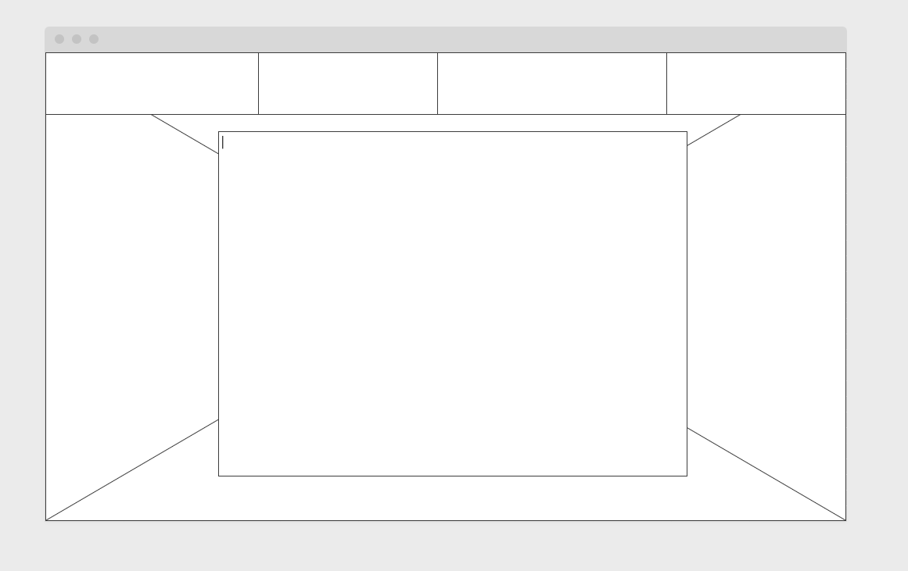
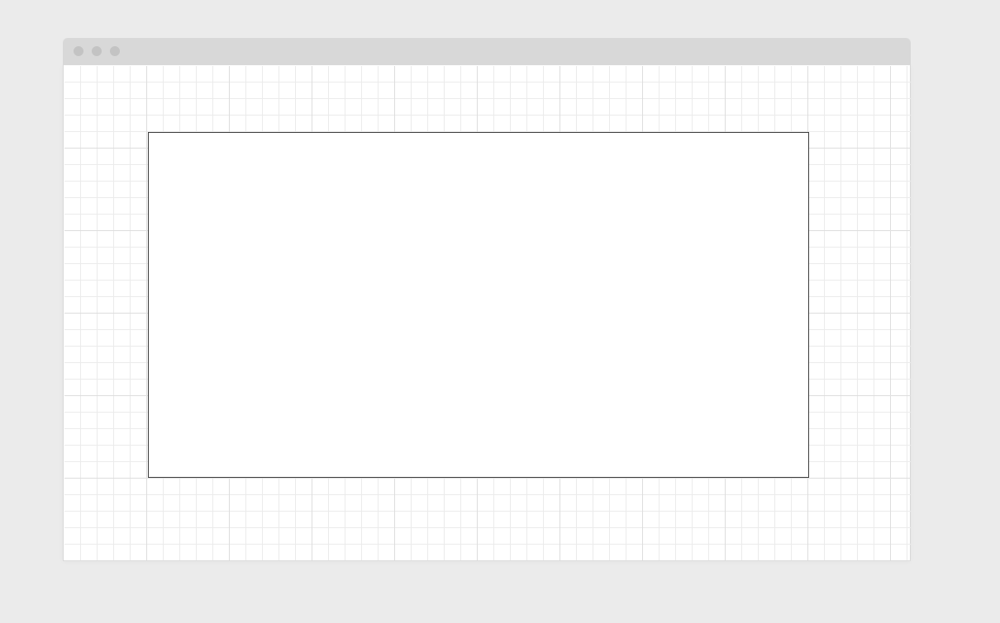
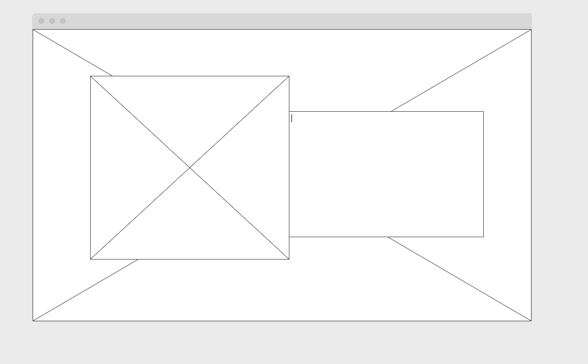
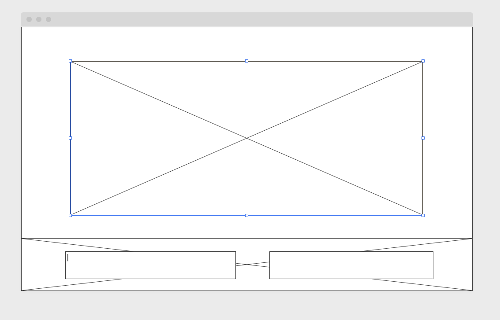

# portfolio-demo
# Portfolio Readme 

## Project Schedule

|  Day | Deliverable | Status
|---|---| ---|
|Day 1| Project Description | Complete
|Day 2| Wireframes / Priority Matrix / Timeline | Complete
|Day 3| Core Application Structure (HTML, CSS, etc.) | Complete
|Day 4| MVP & Bug Fixes | Complete
|Day 5| Final Touches | Complete
|Day 6| Present | Incomplete

## Wireframes

## Time/Priority Matrix 

#### MVP
| Component | Priority | Estimated Time | Actual Time |
| --- | :---: |  :---: | :---: | 
| Project Preview | H | 3hr | hr |
| Horizontal Nav | H | 2hr | hr |   
| Other sections and flex| M | 5hr | hr| 
| Responsive | H | 4hr | hr | hr |
| Skills Icons | L | 1hr |  hr |
| Total | H | 15hrs| hrs |

#### PostMVP
| Component | Priority | Estimated Time | Actual Time |
| --- | :---: |  :---: | :---: | 
| CSS Styling Polishing | H | 4hr | hr |
| Media Queries | L | 4hr | hr | hr |
| Make Home Animation | M | 3hr | hr |
| Total | H | 11hrs| hrs |

## Additional Libraries Used

 No libraries used

## Code Snippet

Particularly proud of the testing and first time use of media queries to make images and formats readable.

## Issues and Resolutions

 Took time to figure out the right positioning for each element but with enough practice flex was starting to become easier. Media queries were difficult at first with images and font sizing but was able to find proper values that made it easier. Javascript was challenging to figure out but managed to get my first animation working.